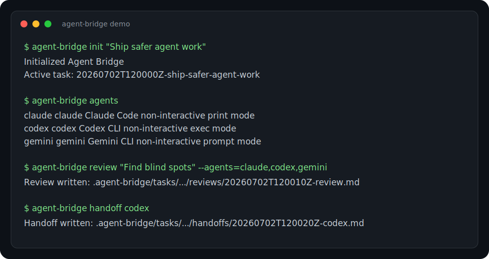

# agent-bridge

[](https://github.com/ksungz/agent-bridge/actions/workflows/ci.yml)

A local agent orchestration CLI for connecting multiple AI coding agents through shared task context, handoff briefs, and review workflows.



Agent Bridge is not another model router. It does not proxy API calls or try to hide one provider behind another provider's interface.

It is a thin local coordination layer for people who already use tools such as Claude Code, Codex CLI, Gemini CLI, custom internal agents, or any other command-line agent. Agent Bridge keeps the task context, decisions, run history, and handoff briefs in one workspace so each agent can work from the same source of truth.

## Why

Using multiple agents manually gets messy fast:

- each agent receives a slightly different version of the task
- decisions disappear between sessions
- review output is scattered across terminals
- the next agent has to be briefed from scratch
- nobody remembers which assumptions were already settled

Agent Bridge gives the workflow a simple filesystem-backed shape:

```text
.agent-bridge/
  config.json
  agents.json
  state.json
  tasks/
    20260702T120000Z-my-task/
      goal.md
      shared-context.md
      decisions.md
      runs/
      reviews/
      handoffs/
```

## Install

Use directly from GitHub:

```bash
npm install github:ksungz/agent-bridge
npx agent-bridge help
```

For local development:

```bash
npm install
npm run build
npm link
```

Then use either command:

```bash
agent-bridge help
ab help
```

## Try It In 60 Seconds

Create a task, ask one agent, then generate a handoff brief:

```bash
agent-bridge init "Ship safer agent work"
agent-bridge agents
agent-bridge ask codex "Review the current plan and point out weak assumptions."
agent-bridge handoff codex
```

Run multiple agents against the same task context:

```bash
agent-bridge review "Find blind spots before I continue." --agents=claude,codex,gemini
```

Everything is written under `.agent-bridge/` so the next agent sees the same goal, shared context, decisions, run history, reviews, and handoff briefs.

## Quick Start

Initialize a task in any project:

```bash
agent-bridge init "Improve portfolio review flow"
```

Edit the shared task files:

```text
.agent-bridge/tasks/<task-id>/goal.md
.agent-bridge/tasks/<task-id>/shared-context.md
.agent-bridge/tasks/<task-id>/decisions.md
```

List configured agents:

```bash
agent-bridge agents
```

Ask one agent:

```bash
agent-bridge ask codex "Review the current plan and point out weak assumptions."
```

Run a multi-agent review:

```bash
agent-bridge review "Compare the implementation risks and next steps." --agents=claude,codex,gemini
```

Create a handoff brief:

```bash
agent-bridge handoff codex
```

Get workspace status:

```bash
agent-bridge digest
```

## Agent Adapters

Adapters are plain JSON. They live in `.agent-bridge/agents.json`.

Default adapters:

```json
{
  "agents": {
    "claude": {
      "command": "claude",
      "args": ["--print", "{{prompt}}"],
      "promptMode": "argument"
    },
    "codex": {
      "command": "codex",
      "args": ["exec", "--skip-git-repo-check", "--sandbox", "read-only", "{{prompt}}"],
      "promptMode": "argument"
    },
    "gemini": {
      "command": "gemini",
      "args": ["--prompt", "{{prompt}}"],
      "promptMode": "argument"
    }
  }
}
```

Any CLI can be attached:

```json
{
  "agents": {
    "local-reviewer": {
      "command": "node",
      "args": ["./tools/local-reviewer.mjs"],
      "promptMode": "stdin"
    }
  }
}
```

Use `{{prompt}}` when the agent expects a prompt argument. Use `promptMode: "stdin"` when the agent should receive the built task prompt over stdin.

Agent Bridge does not manage provider login or billing. Each configured CLI must already work in your local terminal.

## Commands

```bash
agent-bridge init <task name>
agent-bridge agents
agent-bridge task list
agent-bridge task use <task-id>
agent-bridge ask <agent> <prompt> [--dry-run]
agent-bridge review <prompt> [--agents=a,b] [--dry-run]
agent-bridge handoff [target-agent]
agent-bridge digest
```

## Design Principles

- Keep provider CLIs independent. Agent Bridge coordinates local tools; it does not impersonate providers.
- Keep task memory explicit. Goal, context, decisions, runs, reviews, and handoffs are regular files.
- Keep adapters generic. Claude Code, Codex, and Gemini are defaults, not hard requirements.
- Keep handoffs concrete. A handoff should show goal, context, decisions, recent runs, and next-agent instructions.
- Keep automation honest. Runs are recorded with prompt, stdout, stderr, command, exit code, and duration.

## Troubleshooting

### The agent command fails with an auth error

Run the provider CLI directly first:

```bash
claude --help
codex exec --help
gemini --help
```

Then verify the provider's own login or environment variables. Agent Bridge only spawns local commands; it does not create sessions, refresh tokens, or configure API keys.

### Codex prints runtime logs

Some CLIs print runtime diagnostics to stderr even when the final answer is valid. Agent Bridge records stdout and stderr as-is so the run history stays auditable.

### A custom adapter hangs

Use a shorter `timeoutMs` in `.agent-bridge/agents.json` while developing the adapter.

```json
{
  "agents": {
    "custom": {
      "command": "my-agent",
      "args": ["run"],
      "promptMode": "stdin",
      "timeoutMs": 30000
    }
  }
}
```

## Development

```bash
npm install
npm run typecheck
npm test
npm pack --dry-run
```

Tests use fake local agents, so they do not call real Claude Code, Codex, Gemini, or paid models.
