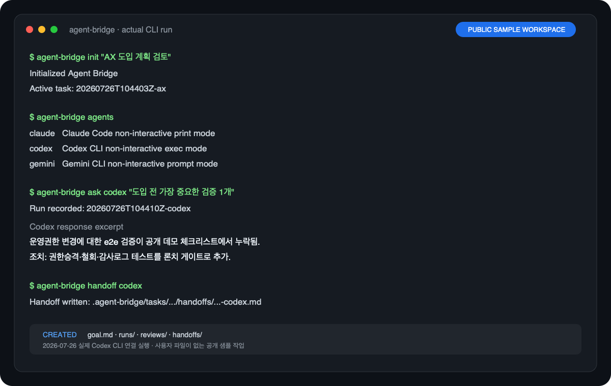
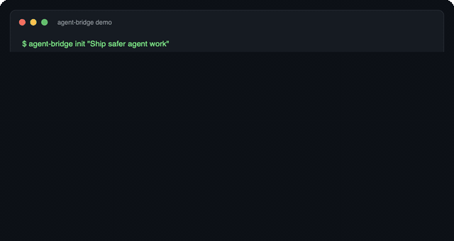

# Agent Bridge

[](https://github.com/ksungz/agent-bridge/actions/workflows/ci.yml)
[](https://github.com/ksungz/agent-bridge/releases/latest)

이미 로그인해 사용하는 여러 AI 코딩 도구를 한 작업 공간에서 함께 사용하도록 연결하는 로컬 CLI입니다.



위 화면은 2026년 7월 26일 사용자 파일이 없는 공개 샘플 작업에서 현재 소스를 빌드한 뒤,
Agent Bridge로 로그인된 Codex CLI를 실제 실행해 만든 기록입니다.
`ask`가 실행 결과를 저장하고 `handoff`가 다음 도구에 전달할 문서를 만드는 흐름을 확인할 수 있습니다.

<details>
<summary><strong>전체 명령 흐름 요약 GIF 보기</strong></summary>



`init → agents → review → handoff` 순서로 한 작업을 만들고,
여러 AI CLI의 결과와 다음 도구에 전달할 내용을 같은 작업 폴더에 남기는 흐름을 요약했습니다.

</details>

## 왜 만들었나요?

Claude Code, Codex, Gemini CLI처럼 구독하고 로그인해서 사용하는 AI 코딩 도구가 여러 개 있어도,
하나의 작업에 함께 사용하려면 요청과 결과를 터미널 사이에서 직접 옮겨야 했습니다.

Agent Bridge는 이 도구들을 API 키 기반의 모델 라우터로 바꾸지 않습니다.
각 CLI의 기존 로그인과 결제 방식은 그대로 유지하고, 다음 정보만 공통 작업 폴더에서 관리합니다.

- 이번 작업의 목표
- 여러 도구가 함께 참고할 공통 맥락
- 작업 중 확정한 결정
- 각 도구의 실행 결과
- 여러 도구의 리뷰 결과
- 다음 도구에 전달할 인계 문서

쉽게 말하면 **AI 모델을 하나로 합치는 도구가 아니라, 여러 AI 도구가 같은 작업 기록을 보며 이어서 일하게 만드는 연결 계층**입니다.

## 어떻게 사용하나요?

### 1. 설치

GitHub에서 바로 설치할 수 있습니다.

```bash
npm install github:ksungz/agent-bridge
npx agent-bridge help
```

로컬에서 개발하려면 다음 명령을 사용합니다.

```bash
npm install
npm run build
npm link
```

설치 후 `agent-bridge` 또는 짧은 명령인 `ab`를 사용할 수 있습니다.

### 2. 작업 만들기

```bash
agent-bridge init "포트폴리오 최종 검토"
```

프로젝트 안에 `.agent-bridge` 작업 폴더가 만들어집니다.

### 3. 한 AI 도구에 요청하기

```bash
agent-bridge ask codex "현재 계획에서 빠진 위험을 검토해줘."
```

### 4. 여러 AI 도구로 같은 내용을 검토하기

```bash
agent-bridge review "구현 전에 놓친 부분을 찾아줘." --agents=claude,codex,gemini
```

### 5. 다음 도구를 위한 인계 문서 만들기

```bash
agent-bridge handoff codex
```

## 무엇이 기록되나요?

```text
.agent-bridge/
  config.json
  agents.json
  state.json
  tasks/
    <task-id>/
      goal.md
      shared-context.md
      decisions.md
      runs/
      reviews/
      handoffs/
```

일반 파일로 저장되므로 어떤 요청이 실행됐고 어떤 결정이 남았는지 직접 확인할 수 있습니다.

### 기록을 공유하기 전에

Agent Bridge는 작업 재현을 위해 프롬프트와 명령, stdout·stderr, 결정과 인계 내용을 로컬 파일에 저장합니다.
현재 사용자의 홈 디렉터리 절대 경로는 저장할 때 `$HOME`으로 바꾸지만,
프롬프트와 실행 결과에 포함된 다른 민감정보까지 자동으로 판별하거나 제거하지는 않습니다.

`.agent-bridge` 폴더를 커밋하거나 다른 사람에게 전달하기 전에는 기록 내용을 직접 확인해야 합니다.

## 주요 명령

```bash
agent-bridge init <작업 이름>
agent-bridge agents
agent-bridge task list
agent-bridge task use <작업 ID>
agent-bridge ask <도구> <요청>
agent-bridge review <요청> --agents=claude,codex,gemini
agent-bridge handoff [다음 도구]
agent-bridge digest
```

## 다른 AI CLI 연결하기

연결할 도구는 `.agent-bridge/agents.json`에 JSON 형식으로 등록합니다.

```json
{
  "agents": {
    "codex": {
      "command": "codex",
      "args": [
        "exec",
        "--skip-git-repo-check",
        "--sandbox",
        "read-only",
        "{{prompt}}"
      ],
      "promptMode": "argument"
    }
  }
}
```

프롬프트를 명령 인자로 받는 도구는 `{{prompt}}`를 사용하고,
표준 입력으로 받는 도구는 `promptMode`를 `stdin`으로 설정합니다.

## 하지 않는 일

- AI 제공자의 로그인이나 결제를 대신 관리하지 않습니다.
- API 호출을 중계하거나 특정 제공자를 다른 모델처럼 보이게 하지 않습니다.
- 구독을 우회하거나 API 프록시를 제공하지 않습니다.
- 아직 긴 맥락을 자동으로 압축하지 않습니다.
- 아직 AI 도구마다 필요한 파일을 자동으로 골라 전달하지 않습니다.

현재 버전은 여러 CLI를 실행하고 작업 목표, 결정, 결과, 리뷰와 인계 기록을 같은 위치에 남기는 기본 구조에 집중합니다.

## 개발과 검증

```bash
npm install
npm run typecheck
npm test
npm pack --dry-run
```

테스트는 가짜 로컬 에이전트를 사용하므로 실제 Claude Code, Codex, Gemini나 유료 API를 호출하지 않습니다.

2026년 7월에는 새 임시 작업 공간에서 GitHub 설치부터 로그인된 Codex CLI 실행,
실행 기록과 인계 문서 생성까지 다시 검증했습니다.
이 과정에서 발견한 홈 디렉터리 경로 노출을 `v0.1.1`에서 마스킹했습니다.

- [자체 검증 기록](docs/validation.md)
- [경로 마스킹 개선 Issue #1](https://github.com/ksungz/agent-bridge/issues/1)

## 라이선스

MIT
